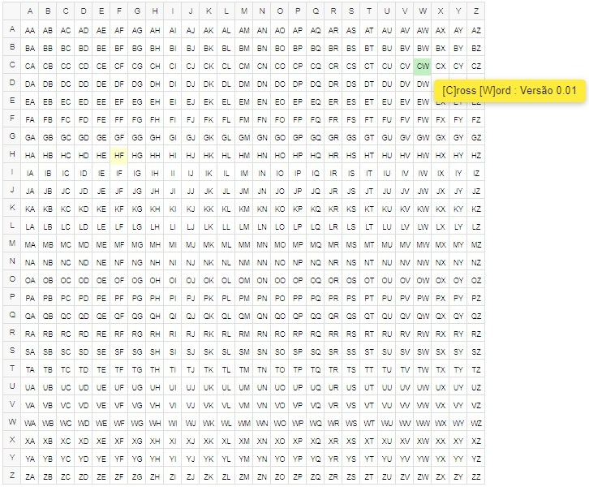
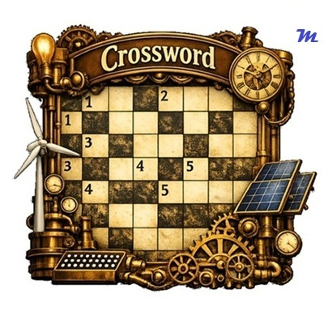

<b>✨KAM — [K]ernel [A]nalytics [M]achine : Suíte de ferramentas KAM </b>
 

    

   💡**KAM Matrix** : É a concatenação de linhas (de A a Z) e colunas (de A a Z).
   * As posições em **amarelo** são funções estruturais facilitadoras.
   * As posições em **verde** são módulos de subrotinas implementadas completas.
   * As posições em **cinza** são funcionalidades futuras.
   * Ao clicar nestas posições ocorre o direcionamento para a área de download.

    

   📋 **Versionamento** 
   |Versão	|Data	| Descrição |
   |-------|-----|-----------|
   |0.00h	|17/03/2026	|Implementação módulo [C]ross [W]ord|
   |0.00g	|31/05/2025 |Ampliação dos Menus|
   |0.00f	|18/05/2025	|Refino da rotina historic|
   |0.00e	|27/04/2025	|Criação de layout do fornulário|
   |0.00d	|22/02/2025	|Elementos & Flexibilidade II|
   |0.00c	|21/02/2025	|Elementos & Flexibilidade I|
   |0.00b	|31/01/2025	|Estruturação do Projeto|
   |0.00a	|30/01/2025	|Concepção das ideias|

<b>✨CW — [C]ross [W]ord : Módulo para geração de palavras cruzadas </b>

 

Após clicar no botão **Download .ZIP**, o seguinte arquivo estará no diretório de downloads: **Install_KAM_v0.00h.bat**
Clique 2X no arquivo .bat e será descompactada a seguinte estrutura abaixo:

⚪**Estrutura de Diretórios** 
* C:\KAM\
    * lib
        * ini
        * png
        * txt
        * ...
    * **KAM_0.00h.xlsm**

🎯 **Objetivo** 
O módulo CW tem como finalidade construir palavras cruzadas para: 
👉🏻Uso Lúdico 
👉🏻Uso Educacional 
👉🏻Exercícios Terapêuticos para pacientes com perda de memória 

🧩 **Características do Módulo**
| Item                              | Valor        |
|-----------------------------------|--------------|
| Versão atual                      | 0.01         |
| Data                              | 2026.APR.02  |
| Desenvolvedor                     | lumacofe     |
| Extensão do arquivo de entrada    | .txt         |
| Número mínimo de palavras         | 2            |
| Número máximo de palavras         | 100          |
| Separador de colunas              | :            |
| Número de colunas                 | 2            |

📄 Exemplos de arquivos texto para uso no **CrossWord**

| Arqvuivo txt  | Nome                                               |
|---------------|----------------------------------------------------|
| Exemplo 1️⃣    | [Continentes.txt](lib/txt/Continentes.txt)        |
| Exemplo 2️⃣    | [Planetas.txt](lib/txt/Planetas.txt)              |
| Exemplo 3️⃣    | [Pontos Cardeais.txt](lib/txt/PontosCardeais.txt) |

⚙️ **Funcionalidades** 
Abaixo a barra de Menus **KAM** que é aberta no Excel ao abrir **CW_0.01.xlsm**   
 

| Função       | Descrição |
|--------------|-----------|
| **File Import**  | Abre a interface para selecionar o arquivo `.txt`. |
| **Gen CW**       | Gera a cruzadinha (Cross Word). |
| **Gen PDF**      | Cria dois arquivos PDF (Sem os rótulos de linhas e colunas da imagem): 🅰️ Um com o gabarito 🅱️ Outro com a cruzadinha sem respostas |
| **About**        |  Exibe a versão do KAM, seu tamanho e link para o site mattlab.| 

**Arquivo PDF** 🅰️ (Gabarito) 
 
**Arquivo PDF** 🅱️ (Cruzadinha) 
 

📢 **Observações** 
1️⃣O algoritmo organiza as palavras da maior para a menor, facilitando a construção da estrutura CW. 
2️⃣Listas muito curtas podem gerar erros, pois existe uma regra que impede palavras de ficarem coladas vertical ou horizontalmente. 
3️⃣A numeração das palavras é inserida automaticamente pela macro, seguindo a regra 1️⃣. 

💡 **Considerações Finais** 
▫️O código é Open Source, desenvolvido em VBA para Excel. 
▫️Código comentado e aberto para edição, alteração e distribuição sem fins comerciais. 
▫️Apenas solicita-se manter os créditos de autoria. 
▫️Críticas, elogios, sugestões ou relatos de bugs são bem-vindos. 
▫️Utilize o formulário “Entre em contato” no site mattlab.com.br.  

