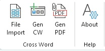
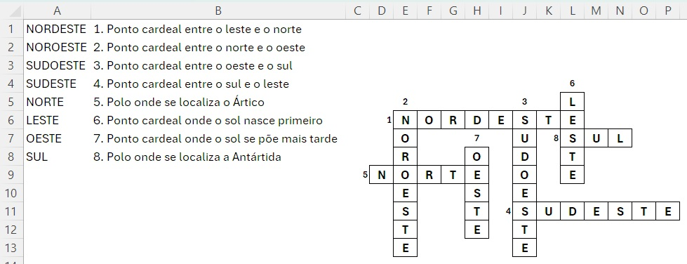
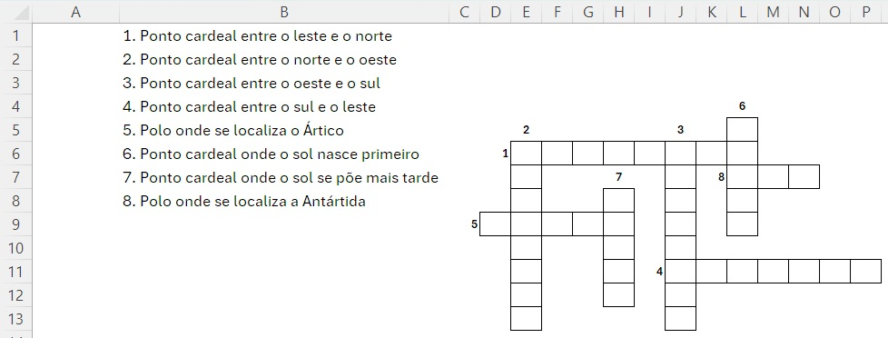

✨ **CW — [C]ross [W]ord: Module for generating crossword puzzles**  
 
After clicking the **Download .ZIP** button, the following file will be in your downloads folder: **Install_KAM_v0.00h.bat**

Double-click the .bat file to extract the directory structure shown below:

⚪**Directory Structure**
* C:\KAM\
    * lib
        * ini
        * png
        * txt
        * ...
    * **KAM_0.00h.xlsm**
      
🎯 **Objective**  
The CW module aims to build crossword puzzles for:  
👉🏻 Recreational Use  
👉🏻 Educational Use  
👉🏻 Therapeutic Exercises for patients with memory loss  

🧩 **Module Features**

| Item                              | Value        |
|-----------------------------------|--------------|
| Current Version                   | 0.01         |
| Date                              | 2026.APR.02  |
| Developer                         | lumacofe     |
| Input File Extension              | .txt         |
| Minimum Number of Words           | 2            |
| Maximum Number of Words           | 100          |
| Column Separator                  | :            |
| Number of Columns                 | 2            |

Example file: **Cardinal Points.txt**

📄 **Example of file content**

NORTH:Pole where the Arctic is located  
SOUTH:Pole where Antarctica is located  
EAST:Cardinal point where the sun rises first  
WEST:Cardinal point where the sun sets later  
NORTHEAST:Cardinal point between east and north  
NORTHWEST:Cardinal point between north and west  
SOUTHWEST:Cardinal point between west and south  
SOUTHEAST:Cardinal point between south and east  

⚙️ **Functionalities**  
Below is the **KAM** menu bar that opens in Excel when loading **CW_0.01.xlsm**  
 

| Function       | Description |
|----------------|-------------|
| **File Import** | Opens the interface to select the `.txt` file. |
| **Gen CW**      | Generates the crossword puzzle. |
| **Gen PDF**     | Creates two PDF files (without row and column labels in the image): 🅰️ One with the answer key 🅱️ Another with the crossword puzzle without answers |
| **About**       | Displays the KAM version, its size, and a link to the mattlab website. |

**PDF File** 🅰️ (Answer Key)  
 

**PDF File** 🅱️ (Crossword Puzzle)  
 

📢 **Notes**  
1️⃣ The algorithm organizes the words from longest to shortest, making it easier to build the CW structure.  
2️⃣ Very short lists may generate errors, as there is a rule preventing words from touching vertically or horizontally.  
3️⃣ Word numbering is automatically inserted by the macro, following rule 1️⃣.  

💡 **Final Considerations**  
▫️ The code is Open Source, developed in VBA for Excel.  
▫️ The code is commented and open for editing, modification, and non-commercial distribution.  
▫️ Please keep the author credits.  
▫️ Feedback, suggestions, compliments, or bug reports are welcome.  
▫️ Use the “Contact Us” form on the mattlab.com.br website.  
